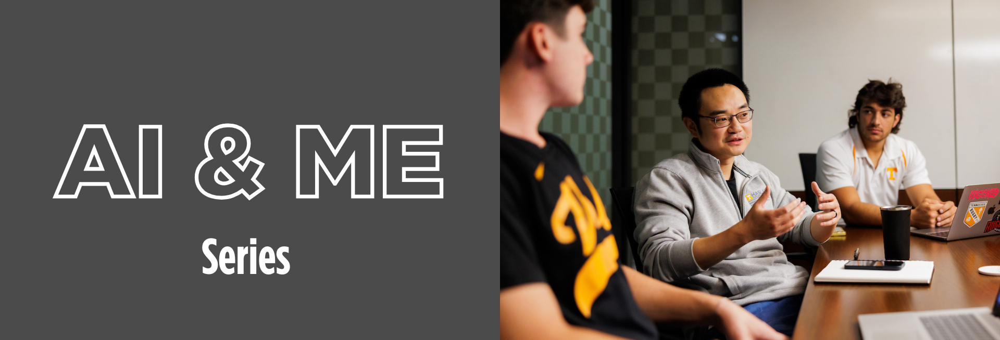

{fig-alt="AI and ME Series banner showing a faculty member speaking with students around a conference table at the University of Tennessee."}

::: {.callout-note appearance="simple" icon=false}
**Elevating Higher Education with AI**

**University of Tennessee, Knoxville (CEHHS), in collaboration with Teaching & Learning Innovation · Principal Investigator: Dr. Yukyeong Song · Role: Instructor and project contributor**
:::

  <a class="button" href="https://teaching.utk.edu/ai-me/" target="_blank" rel="noopener">Explore the AI & ME series</a>
  <a class="button ghost" href="https://tpte-ut.pdx.catalog.canvaslms.com/courses/ai-and-me" target="_blank" rel="noopener">View the self-paced course</a>

## Project overview

**AI & ME** is a national professional development initiative focused on responsible and effective uses of generative AI in higher education teaching, assessment, research, media creation, and faculty workflows. The initiative was developed by the University of Tennessee, Knoxville's College of Education, Health, and Human Sciences in collaboration with Teaching & Learning Innovation.

The project combines a five-session live webinar series with a self-paced Canvas course, extending expert-led programming into an accessible resource that faculty, graduate assistants, instructional designers, and academic support staff can revisit and complete asynchronously.

## Five-session webinar series

The 2026 series addressed five complementary areas:

1. **Cultivating AI Literacy in Online Courses**
2. **AI for Faculty Productivity: Local AI for FERPA and Faculty Tools**
3. **Building Your Own AI Research Assistant Using Open-Sourced Cyberinfrastructure**
4. **AI Ethics: Can We? Should We? Navigating Ethical Dilemmas of AI in Higher Education**
5. **Designing GenAI-Enhanced Educational Media with Google AI Studio**

Together, the sessions connected foundational AI literacy, practical faculty workflows, privacy-aware research tools, ethical decision-making, and AI-supported educational media design.

## A scalable professional learning model

::: {.card-grid}
::: {.card}
### Live engagement

Multi-session webinars created opportunities for expert demonstrations, participant questions, discussion, and interactive professional learning.
:::

::: {.card}
### Asynchronous access

Recordings, transcripts, and curated resources were organized into a self-paced Canvas course for continued and scalable faculty learning.
:::

::: {.card}
### Recognized completion

Synchronous and asynchronous completion workflows supported certificates that recognize participant engagement.
:::
:::

## My contributions

I am listed as an instructor for the self-paced course and contributed across the live series and its conversion into an open professional learning resource. My work included:

- Coordinating implementation of the five-session live webinar series, including logistics, speaker support, participant communication, and post-session resource management.
- Supporting delivery of interactive learning experiences for a national higher education audience.
- Producing, editing, and organizing webinar transcripts and learning artifacts to improve accessibility and reuse.
- Developing the self-paced Canvas course by curating recordings, structuring learning modules, and aligning supporting resources.
- Supporting certificate-of-completion workflows for synchronous and asynchronous participation.
- Contributing to the project's visibility as a cross-unit professional development initiative in AI and higher education.

## Course format and audience

The Canvas course is organized around the five workshop sessions. Each session is designed for approximately two hours of engagement and includes a brief reflection activity. The intended audience includes higher education faculty, graduate assistants, instructional designers, academic support professionals, and other educators interested in integrating AI into teaching and learning.

Enrollment availability is managed through Canvas Catalog and may change over time; the public course page remains the authoritative source for current access information.

## Project links

- [AI & ME series at Teaching & Learning Innovation](https://teaching.utk.edu/ai-me/)
- [AI and Me self-paced course in Canvas Catalog](https://tpte-ut.pdx.catalog.canvaslms.com/courses/ai-and-me)
