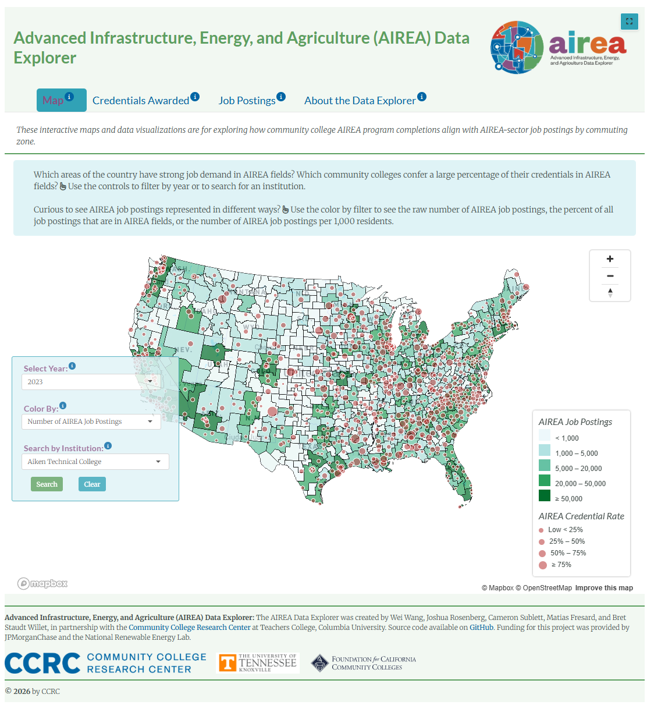

{fig-alt="Screenshot of the AIREA Data Explorer displaying U.S. commuting zones, community colleges, filters, and legends for AIREA job postings and credential rates."}

::: {.callout-note appearance="simple"}
## Official CCRC release

The **Advanced Infrastructure, Energy, and Agriculture (AIREA) Data Explorer** is published by the [Community College Research Center](https://ccrc.tc.columbia.edu/dashboard/airea-tool.html) at Teachers College, Columbia University. It helps researchers, policymakers, and college leaders examine how community college credentials align with regional demand for AIREA-sector workers.
:::

  <a class="button" href="https://ccrc.tc.columbia.edu/dashboard/airea-tool.html" target="_blank" rel="noopener">View official CCRC page</a>
  <a class="button ghost" href="https://ed-analytics.shinyapps.io/airea-data-explorer/" target="_blank" rel="noopener">Launch the explorer</a>
  <a class="button ghost" href="https://github.com/data-edu/airea-data-explorer-shiny" target="_blank" rel="noopener">View source code</a>

## Project overview

Community colleges play a central role in preparing students for work in advanced infrastructure, energy, and agriculture. However, education and workforce data are often stored in separate systems, making it difficult to understand whether local credential production aligns with regional labor-market demand.

The AIREA Data Explorer brings these sources together in one national, interactive tool. Users can examine community college credentials, explore AIREA job postings across U.S. commuting zones, compare regions and institutions, and study how these patterns have changed since 2010.

## My role and contributions

I co-developed the AIREA Data Explorer and contributed to the design and implementation of its interactive visualization system. My work included:

- Building Shiny interface and server components for the map, credential, job-posting, and methodology views.
- Implementing Mapbox GL JS interactions for U.S. commuting zones and community college locations.
- Integrating institution search, year selection, metric controls, hover details, and linked visualizations.
- Preparing and connecting multi-year credential, job-posting, population, and geospatial data.
- Improving performance by separating geospatial data into year-specific files and updating map sources without rebuilding the full application.
- Supporting the transition from the early **CCRC Green Seek** prototype to the final AIREA-branded public release.

## What users can explore

::: {.card-grid}
::: {.card}
### National map

Compare AIREA job demand across commuting zones while viewing community college locations and credential rates.
:::

::: {.card}
### Credentials awarded

Search colleges, compare leading institutions, and examine AIREA credentials by program, award level, and year.
:::

::: {.card}
### Job postings

Explore total postings, AIREA's share of all postings, postings per 1,000 residents, occupational demand, and trends over time.
:::

::: {.card}
### Methods and downloads

Review the AIREA classification methodology and download occupation, program, credential, and job-posting tables.
:::
:::

## Data and technical approach

The explorer combines several complementary data sources and technologies:

- **Community college credentials:** Integrated Postsecondary Education Data System (IPEDS).
- **Labor-market demand:** Lightcast job postings from 2010 onward.
- **Occupations and programs:** AIREA classifications connecting SOC occupations with CIP programs of study.
- **Regional geography:** U.S. commuting zones, which approximate local labor markets across county boundaries.
- **Application stack:** R, Shiny, Mapbox GL JS, Plotly, GeoJSON, and JavaScript.

The final application supports multiple views of demand—including raw AIREA job postings, the percentage of all postings in AIREA fields, and postings per 1,000 residents—while connecting those measures to community college credential production.

## From prototype to public data tool

The project began as **CCRC Green Seek**, a prototype focused on green-program completions and green-sector job demand. Through continued research, classification work, data engineering, and user-experience development, it expanded into AIREA: a broader framework encompassing advanced infrastructure, energy, agriculture, and adjacent high-opportunity occupations.

The final release added dedicated credential and job-posting dashboards, institution and commuting-zone searches, ranking tables, downloads, methodology documentation, responsive controls, and CCRC's public-facing visual identity.

## Team and partners

The AIREA Data Explorer was created by **Wei Wang, Joshua Rosenberg, Cameron Sublett, Matias Fresard, and Bret Staudt Willet**, in partnership with the Community College Research Center at Teachers College, Columbia University.

The project also acknowledges the University of Tennessee, Knoxville and the Foundation for California Community Colleges. Funding was provided by JPMorganChase and the National Renewable Energy Laboratory.

## Project links

- [Official CCRC project page](https://ccrc.tc.columbia.edu/dashboard/airea-tool.html)
- [Open the AIREA Data Explorer](https://ed-analytics.shinyapps.io/airea-data-explorer/)
- [Source code on GitHub](https://github.com/data-edu/airea-data-explorer-shiny)
- [AIREA Data Explorer OSF repository](https://osf.io/x9jz6/)
