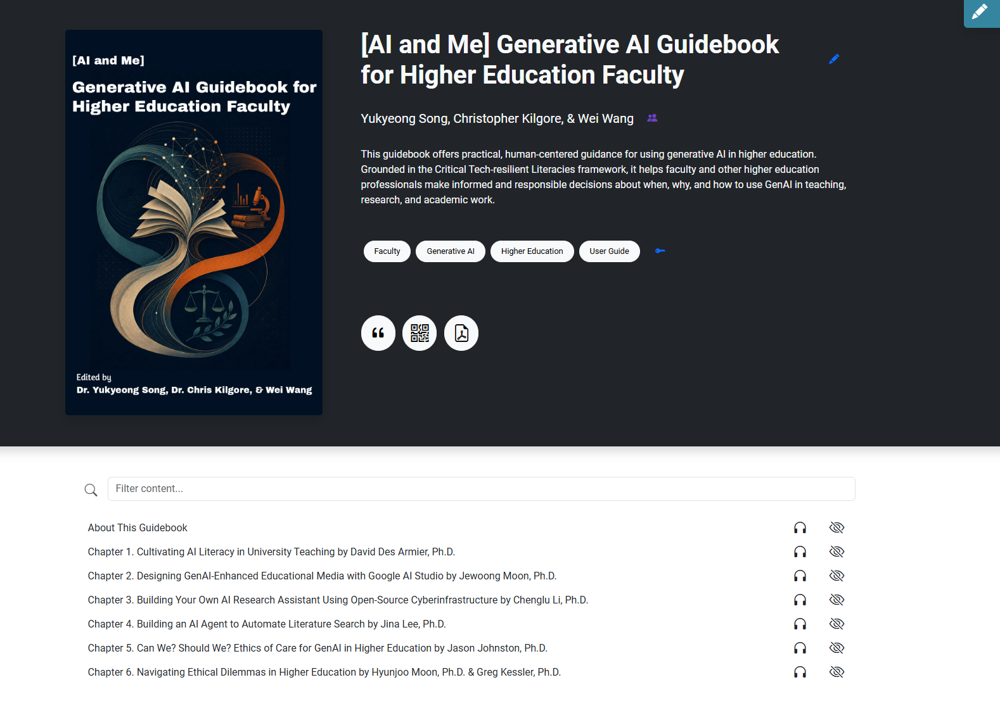

<figure class="guidebook-cover">

<figcaption>Official guidebook cover.</figcaption>
</figure>

::: {.callout-note appearance="simple" icon=false}
**Co-editor · EdTech Books · Awaiting administrator review**

The guidebook has been submitted in the EdTech Books open publishing system. Public release is pending administrator approval.
:::

  <a class="button" href="https://edtechbooks.org/ai_and_me" target="_blank" rel="noopener">View on EdTech Books</a>
  <a class="button ghost" href="../../Projects/AI_and_ME/AI_and_ME.qmd">View the AI & ME project</a>
  <a class="button ghost" href="https://tpte-ut.pdx.catalog.canvaslms.com/courses/ai-and-me" target="_blank" rel="noopener">Explore the course</a>

## About the guidebook

*[AI and Me] Generative AI Guidebook for Higher Education Faculty* is being prepared for open publication through EdTech Books and is currently awaiting administrator review. It grows out of the five-session **AI and Me: Navigating GenAI for Higher Education Faculty** webinar series and its self-paced course.

The guidebook offers practical, human-centered guidance for using generative AI in higher education. Grounded in the Critical Tech-resilient Literacies framework, it supports informed and responsible decisions about when, why, and how to use generative AI in teaching, research, and academic work.

## My role

As a **co-editor**, I helped shape the webinar materials into a coherent, accessible guidebook for a broader higher education audience. My contributions included:

- Coordinating and supporting delivery of the five-session national webinar series.
- Editing transcripts and learning materials for clarity, accessibility, and reuse.
- Organizing the self-paced course and connecting its modules with the guidebook's practical resources.
- Supporting the guidebook's development as an open resource for faculty learning.

The guidebook is edited by **Yukyeong Song, Christopher Kilgore, and Wei Wang**.

## From live series to open resource

The project connects three forms of professional learning:

1. A national live webinar series featuring faculty and practitioners.
2. A self-paced Canvas course that makes recordings and learning activities available asynchronously.
3. An open guidebook that organizes the series' ideas into a reusable reference for higher education faculty.

## Resource links

- [Guidebook in the EdTech Books open publishing system](https://edtechbooks.org/ai_and_me)
- [AI & ME series at the University of Tennessee](https://teaching.utk.edu/ai-me/)
- [AI and Me self-paced course](https://tpte-ut.pdx.catalog.canvaslms.com/courses/ai-and-me)
- [AI & ME project details on this website](../../Projects/AI_and_ME/AI_and_ME.qmd)

## Publication status

- **Platform:** EdTech Books
- **Current status:** Awaiting administrator review
- **Public release:** Pending approval
- **Editors:** Yukyeong Song, Christopher Kilgore, and Wei Wang
