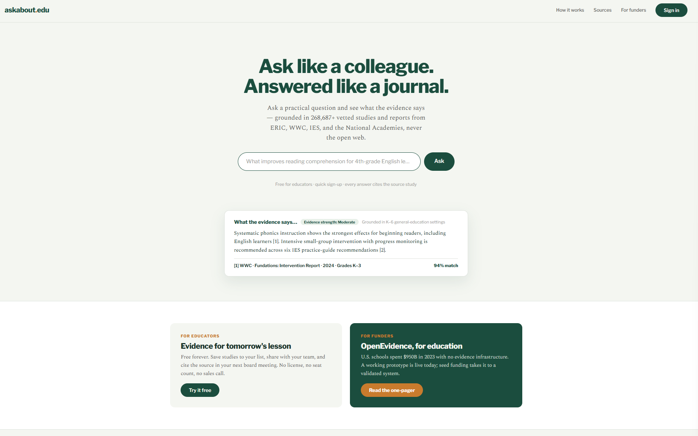
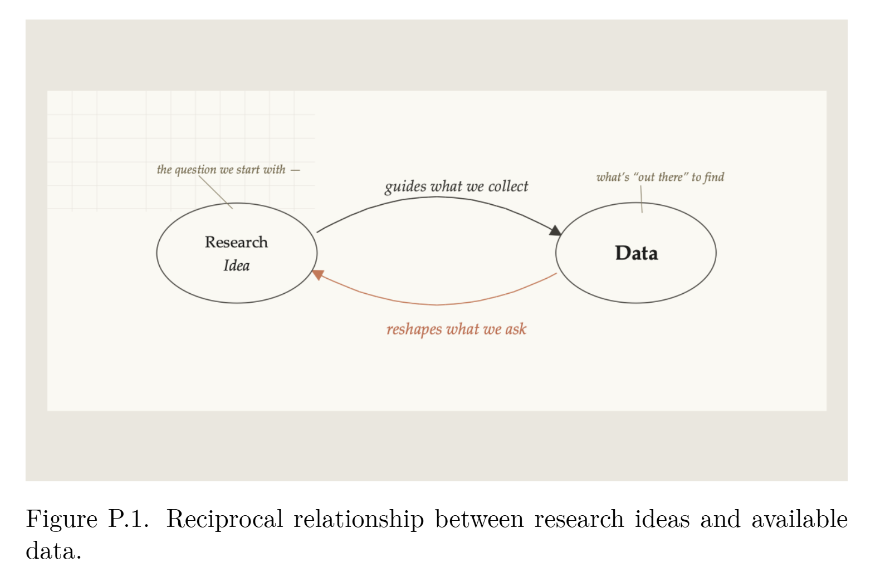

  
Co-founder<strong>askabout.edu</strong>

  
Research leadership<strong>Student PI</strong>

  
Forthcoming<strong>CRC Press first author</strong>

  
Public data tools<strong>AIREA · R · Shiny</strong>

## Featured work

<article class="featured-card">

Co-founder · Educational AI

<h3><a href="Projects/Ask_About_EDU/Ask_About_EDU.qmd">askabout.edu</a></h3>

Evidence-informed decision support that turns verified research into context-aware answers with transparent citations.

<a class="featured-link" href="Projects/Ask_About_EDU/Ask_About_EDU.qmd">Explore the product →</a>

</article>
<article class="featured-card">

First author · Forthcoming 2026

<h3><a href="Publications/Computational_Analysis_Educational_Data/Book.qmd">Computational Analysis of Educational Data</a></h3>

A CRC Press field guide to text, relational, numeric, and multimodal educational data with R and modern AI methods.

<a class="featured-link" href="Publications/Computational_Analysis_Educational_Data/Book.qmd">Explore the book →</a>

</article>
<article class="featured-card">

Public data tool · CCRC

<h3><a href="Projects/CCRC_Green_Seek_Mapping%20Project/GreenSeek.qmd">AIREA Data Explorer</a></h3>

A national interactive tool connecting community college AIREA credentials with regional workforce demand.

<a class="featured-link" href="Projects/CCRC_Green_Seek_Mapping%20Project/GreenSeek.qmd">Explore the data tool →</a>

</article>

## Research focus

::: {.card-grid}
::: {.card}
### GenAI in education
Studying learning design, faculty practice, and human–AI dialogue that strengthen critical thinking and responsible use.

[Teaching and learning →](Teaching.qmd)
:::
::: {.card}
### Educational data science
Building analyses and public tools for large-scale educational, workforce, text, and relational data.

[Research projects →](Projects.qmd)
:::
::: {.card}
### Research communication
Translating technical work into publications, visual explanations, open resources, and practitioner-facing products.

[Publications →](Publications.qmd)
:::
:::
